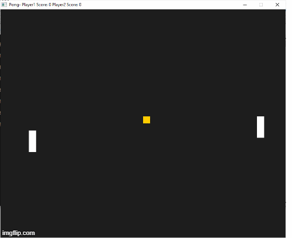

# CPPND: Capstone Pong Game

This is a the repo for the Capstone project in the [Udacity C++ Nanodegree Program](https://www.udacity.com/course/c-plus-plus-nanodegree--nd213). The code for this repo was inspired by the Snake game that is present [here](https://github.com/udacity/CppND-Capstone-Snake-Game.git)

The Pong game presented in this repo is the classic Pong game that is played with 2 paddles and a  ball. The paddles can be moved up and down to ensure that the ball doesn't get past the paddle. If that happens then the other player wins.

To control the right paddle use arrow keys up and down while to control the left paddle use alphabets "w"(for moving the paddle up) and "s"(for moving the paddle down).

The game will reset after 3 seconds once a player wins.

The class structure used is very similar to the one used for Snake game. Another class called Ball was added to control the behavior of the ball.

## Dependencies for Running Locally
* cmake >= 3.7
  * All OSes: [click here for installation instructions](https://cmake.org/install/)
* make >= 4.1 (Linux, Mac), 3.81 (Windows)
  * Linux: make is installed by default on most Linux distros
  * Mac: [install Xcode command line tools to get make](https://developer.apple.com/xcode/features/)
  * Windows: [Click here for installation instructions](http://gnuwin32.sourceforge.net/packages/make.htm)
* SDL2 >= 2.0
  * All installation instructions can be found [here](https://wiki.libsdl.org/Installation)
  * Note that for Linux, an `apt` or `apt-get` installation is preferred to building from source.
* gcc/g++ >= 5.4
  * Linux: gcc / g++ is installed by default on most Linux distros
  * Mac: same deal as make - [install Xcode command line tools](https://developer.apple.com/xcode/features/)
  * Windows: recommend using [MinGW](http://www.mingw.org/)

## Basic Build Instructions

1. Clone this repo.
2. Make a build directory in the top level directory: `mkdir build && cd build`
3. Compile: `cmake .. && make`
4. Run it: `./SnakeGame`.

## For running on Windows
1. Clone this repo.
2. Make a build directory in the top level directory: `mkdir build && cd build`
3. Please download the mingw version (not the VC version) of SDL2 at https://www.libsdl.org/download-2.0.php under Development Libraries. Then you may want to use the i686-w64-mingw32 which is for 32 bit.
4. Update the prefix, SDL2_PREFIX, SDL2_EXEC_PREFIX in sdl2-config.make present at i686-w64-mingw32\lib\cmake\SDL2
5. In CMakeCache.txt, update SDL2_DIR path with the location of sdl2-config.cmake
6. cmake configure and build the project. You should get a .exe file that you can run under build folder
7. If a error regarding SDL2.dll pops up, provide the SDL2.dll location in PATH environment variable. SDL2.dll can be found under i686-w64-mingw32\bin

## Rubric points addressed
1. The project demonstrates an understanding of C++ functions and control structures - This can be found throughout the code.
2. The project accepts user input and processes the input - This can be found in controller.cpp where based on user input the paddles move up and down.
3. The project uses Object Oriented Programming techniques - This can be again found throughout the code. The code uses the following classes: Paddle, Ball, Game, Controller, Renderer.
4. Classes use appropriate access specifiers for class members - All the classes mentioned in (3) use appropriate access specifiers.
5. The project makes use of references in function declarations - Few of the functions where references have been used are PastPaddle function in Ball and Run function in Game.
